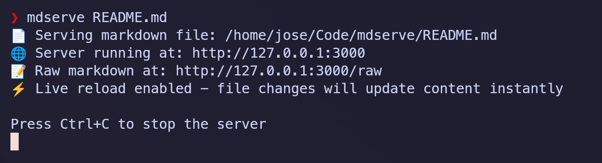
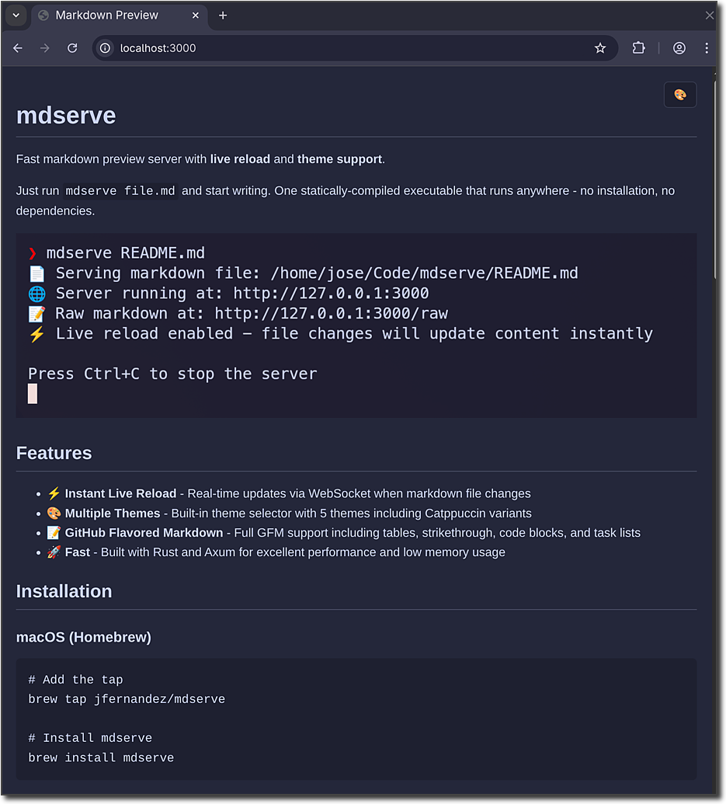

# mdserve

Markdown preview server for AI coding agents.

Follow along as your AI agent writes markdown, rendered live in the browser
instead of raw text in the terminal.



## Features

**Zero config.** `mdserve file.md` just works. No config files, no flags
required, no setup steps.

**Single binary.** One statically-compiled executable. Install it and forget
about it. No runtime dependencies to manage.

**Instant live reload.** File changes appear in the browser immediately via
WebSocket. This is the core interaction: an agent writes, a human reads.

**Ephemeral sessions.** Start it during a coding session, kill it when you're
done. mdserve is not a long-running server and doesn't need to be.

**Agent-friendly content.** Full GFM support (tables, task lists, code blocks),
Mermaid diagrams, and directory mode with sidebar navigation - the kinds of
content AI coding agents actually produce.

## What mdserve is not

- **Not a documentation site generator.** Use mdBook, Docusaurus, or MkDocs
  for that.
- **Not a static site server** or something you deploy to production.
- **Not a general-purpose markdown authoring tool** with heavy customization
  for manual writing workflows.

## Installation

### macOS (Homebrew)

```bash
brew install mdserve
```

### Linux

```bash
curl -sSfL https://raw.githubusercontent.com/jfernandez/mdserve/main/install.sh | bash
```

This will automatically detect your platform and install the latest binary to your system.

### Alternative Methods

#### Using Cargo

```bash
cargo install mdserve
```

#### Arch Linux

```bash
sudo pacman -S mdserve
```

#### Nix Package Manager

``` bash
nix profile install github:jfernandez/mdserve
```

#### From Source

```bash
git clone https://github.com/jfernandez/mdserve.git
cd mdserve
cargo build --release
cp target/release/mdserve <folder in your PATH>
```

#### Manual Download

Download the appropriate binary for your platform from the [latest release](https://github.com/jfernandez/mdserve/releases/latest).

## Claude Code Plugin

mdserve includes a [Claude Code plugin](https://code.claude.com/docs/en/plugins-reference.md)
that teaches the agent when and how to launch markdown previews during coding
sessions. With the plugin installed, Claude Code will automatically serve
markdown files when the content benefits from rendered presentation (tables,
diagrams, long documents) and skip the preview for short responses that read
fine in the terminal.

### Install the plugin

In Claude Code, run:

```
/plugin install mdserve@mdserve
```

This installs to user scope by default (available across all projects). To
install at a different scope:

```
/plugin install mdserve@mdserve --scope project   # for all collaborators
/plugin install mdserve@mdserve --scope local      # for yourself in this repo
```

> **Note:** The `mdserve` binary must also be installed on your system (see
> [Installation](#installation) above).

## Usage

### Basic Usage

```bash
# Serve a single markdown file on default port (3000)
mdserve README.md

# Serve all markdown files in a directory
mdserve docs/

# Serve on custom port
mdserve README.md --port 8080
mdserve docs/ -p 8080

# Serve on custom hostname and port
mdserve README.md --hostname 0.0.0.0 --port 8080

# Open in browser automatically
mdserve README.md --open
```

### Single-File vs Directory Mode

**Single-File Mode**: When you pass a file path, mdserve serves that specific markdown file with a clean, focused view.

**Directory Mode**: When you pass a directory path, mdserve automatically:
- Scans and serves all `.md` and `.markdown` files in that directory
- Displays a navigation sidebar for easy switching between files
- Watches for new markdown files added to the directory
- Only monitors the immediate directory (non-recursive)


## Themes

Five built-in themes (light, dark, and Catppuccin variants) accessible from the
theme picker in the top-right corner. Your choice persists across sessions.



## Documentation

For detailed information about mdserve's internal architecture, design decisions, and how it works under the hood, see [Architecture Documentation](docs/architecture.md).

## Development

### Prerequisites

- Rust 1.85+ (2024 edition)

### Building

```bash
cargo build --release
```

### Running Tests

```bash
# Run all tests
cargo test

# Run integration tests only
cargo test --test integration_test
```

## Contributing

Contributions should enhance the agent-companion workflow. The best PRs improve
rendering of content that agents produce (code blocks, diagrams, tables, math),
make live reload more robust, or refine the zero-config experience. Features
that push mdserve toward being a documentation platform or a configurable server
are out of scope.

We use [conventional commits](https://www.conventionalcommits.org/) (`feat:`,
`fix:`, `chore:`, etc.). PRs that don't follow this style will not be merged.

## License

This project is licensed under the MIT License - see the [LICENSE](LICENSE) file for details.

## Acknowledgments

- Built with [Axum](https://github.com/tokio-rs/axum) web framework
- Markdown parsing by [markdown-rs](https://github.com/wooorm/markdown-rs)
- [Catppuccin](https://catppuccin.com/) color themes
- Inspired by various markdown preview tools
