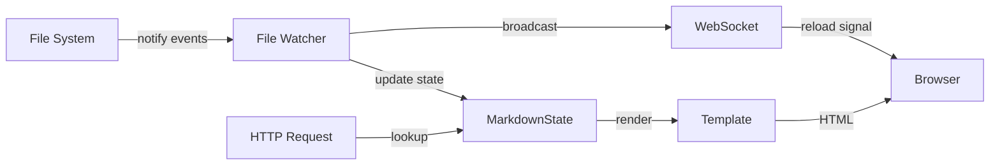
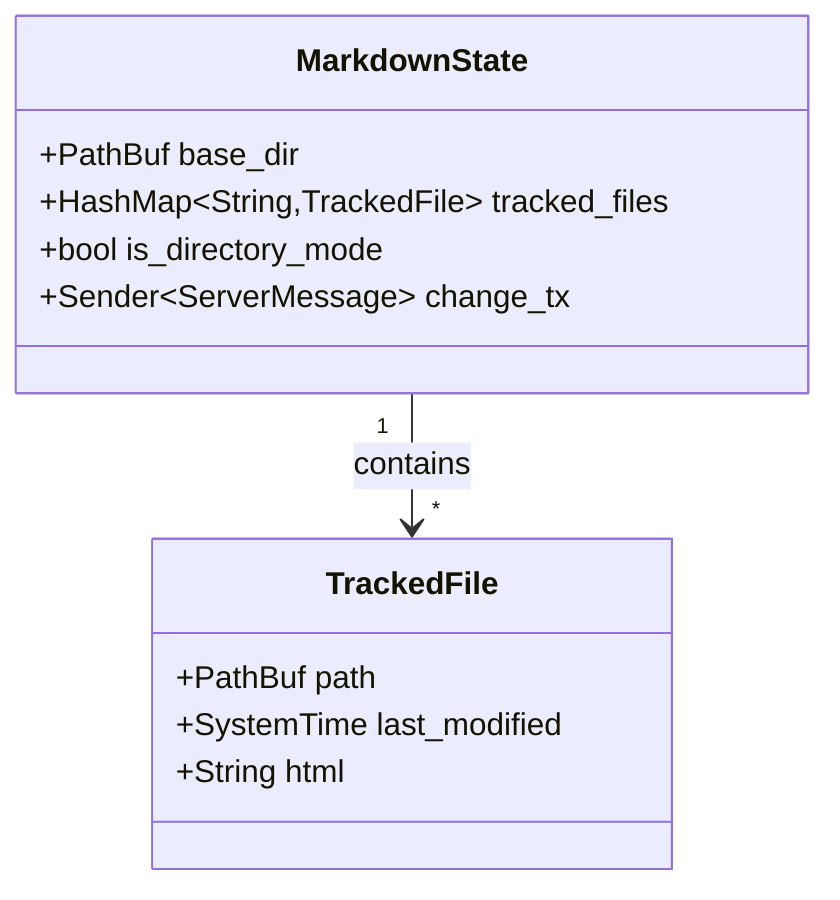

# mdserve Architecture

## Overview

mdserve is a simple HTTP server for markdown preview with live reload. It supports both single-file and directory modes with a unified codebase.

**Core principle**: Always work with a base directory and a list of tracked files (1 or more).



## Modes

### Single-File Mode
```bash
mdserve README.md
```
- Watches parent directory
- Tracks single file
- No navigation sidebar

### Directory Mode
```bash
mdserve ./docs/
```
- Watches specified directory
- Tracks all `.md` and `.markdown` files
- Shows navigation sidebar

## Architecture

### State Management

Central state stores:
- Base directory path
- HashMap of tracked files (filename → metadata + pre-rendered HTML)
- Directory mode flag (determines UI)
- WebSocket broadcast channel



Mode is determined by user intent, not file count:
- `mdserve /docs/` with 1 file shows sidebar
- `mdserve single.md` never shows sidebar

**Example states:**

Single-file mode:
```
base_dir = /path/to/docs/
tracked_files = {
  "README.md": TrackedFile { ... }
}
is_directory_mode = false
```

Directory mode:
```
base_dir = /path/to/docs/
tracked_files = {
  "api.md": TrackedFile { ... },
  "guide.md": TrackedFile { ... },
  "README.md": TrackedFile { ... }
}
is_directory_mode = true
```

### Live Reload

Uses [notify](https://github.com/notify-rs/notify) crate to watch base directory (non-recursive):
- Create/modify: Refresh file, add if new (directory mode only)
- Delete: Remove from tracking
- Rename: Remove old, add new
- All changes trigger WebSocket reload broadcast

File changes flow:
1. File system event detected by `notify`
2. Markdown re-rendered to HTML
3. State updated (refresh/add/remove tracked file)
4. `ServerMessage::Reload` broadcast via WebSocket channel
5. All connected clients receive reload message
6. Clients execute `window.location.reload()`

### Routing

Single unified router handles both modes:
- `GET /` → First file alphabetically
- `GET /:filename.md` → Specific markdown file
- `GET /:filename.<ext>` → Images from base directory
- `GET /ws` → WebSocket connection
- `GET /mermaid.min.js` → Bundled Mermaid library

The `:filename` pattern rejects paths with `/`, preventing directory traversal.

### Rendering

Uses [MiniJinja](https://github.com/mitsuhiko/minijinja) (Jinja2 template syntax) with templates embedded at compile time via [minijinja_embed](https://github.com/mitsuhiko/minijinja/tree/main/minijinja-embed).

Conditional template rendering:
- Directory mode: Includes navigation sidebar with active file highlighting
- Single-file mode: Content only
- Both use same pre-rendered HTML from state

Template variables:
- `content`: Pre-rendered markdown HTML
- `mermaid_enabled`: Boolean flag, conditionally includes Mermaid.js when diagrams detected
- `show_navigation`: Controls sidebar visibility
- `files`: List of tracked files (directory mode)
- `current_file`: Active file name (directory mode)

## Design Decisions

**Unified architecture**: Single code path handles both single-file and directory modes. Mode determined by user intent, not file count.

**Pre-rendered caching**: All tracked files rendered to HTML in memory on startup and file change. Serving always from memory, never from disk.

**Non-recursive watching**: Only immediate directory, no subdirectories. Simplifies security and state management.

**Server-side logic**: Most logic lives server-side (markdown rendering, file tracking, navigation, active file highlighting, live reload triggering). Client-side JavaScript minimal (theme management, reload execution).

## Constraints

- Non-recursive (flat directories only)
- Alphabetical file ordering only
- All files pre-rendered in memory
